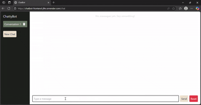

# Smart E-Commerce Chatbot

A full-stack conversational chatbot application that enables users to search for e-commerce products through a chat interface. The chatbot supports dynamic product recommendations, maintains session continuity, and is built with a modern tech stack: **React + Tailwind CSS (Frontend)** and **Python + Flask (Backend)**.

---

 Project Overview

This project simulates a smart shopping assistant capable of responding to natural language queries. Users can engage in multi-session chat conversations, search for products using keywords or flexible expressions, and receive real-time product recommendations rendered as interactive cards.

---

## 🎬 App Demo




## ⚙️ Tech Stack

### Frontend

* **Framework:** React (bootstrapped with Vite)
* **Styling:** Tailwind CSS
* **HTTP Client:** Axios
* **Session Management:** LocalStorage

### Backend

* **Language:** Python 3
* **Framework:** Flask
* **Data:** `products.json` (mock product database)
* **Utilities:** Flask-CORS, JSON, difflib (for fuzzy search)

---

## 💡 Features

### ✅ Frontend Features

* Responsive chatbot UI with support for desktop, tablet, and mobile screens
* Sidebar for listing all chat sessions with options to create or delete a session
* Session persistence using `localStorage`
* Dynamic rendering of chat history and product cards with images, ratings, and price
* Interactive product search via chat interface

### ✅ Backend Features

* REST API with endpoints:

  * `POST /chat` — Process a user message and return product recommendations
  * `POST /new_conversation` — Start a new chat session
  * `DELETE /conversation` — Delete a specific conversation
  * `GET /history` — Retrieve chat history (optional)
* Reads and parses mock data from `products.json`
* Implements both basic and fuzzy string matching for more accurate product search
* Always returns a `bot` message even if no products match

---

## 🗂 Project Structure

```
📦 ecommerce-chatbot
├── frontend
│   ├── components
│   │   ├── ChatApp.jsx
│   │   ├── ChatWindow.jsx
│   │   └── ChatSidebar.jsx
│   └── index.html / main.jsx
├── backend
│   ├── app.py
│   └── products.json
```

---

## 📊 Mock Data: `products.json`

* Contains structured product objects with fields: `id`, `name`, `price`, `rating`, `image`
* Categories: laptops, mobiles, accessories, wearables, monitors
* Product images use `https://via.placeholder.com` for testing and UI completeness

Example:

```json
{
  "id": 1,
  "name": "HP Pavilion 15 Laptop",
  "price": 59999,
  "rating": 4.2,
  "image": "https://via.placeholder.com/150?text=HP+Pavilion"
}
```

---

## 🔁 Chat Flow Logic

1. User types a message (e.g., "Show me Dell laptops")
2. Axios sends a `POST` request to `/chat`
3. Flask processes the message and searches `products.json`
4. Returns a JSON response with a `bot` message and an array of `products`
5. React updates the chat with the bot response and renders cards if available

---

## 🧠 Search Matching

* Initially supported simple `message in product_name` matching
* Enhanced using `difflib.get_close_matches` to support fuzzy logic (e.g., "iphne" ≈ "iPhone")
* Plans to support structured filtering (e.g., price < 50000, rating > 4.0)

---

## 🚧 Challenges Faced & Solutions

* **CORS Errors**: Resolved by configuring Flask-CORS properly
* **Empty Bot Responses**: Ensured backend always sends a default fallback message
* **Message Mapping Bug**: Refactored JSX in `ChatWindow.jsx` to handle flexible response structures
* **Poor Search Precision**: Implemented fuzzy search using `difflib`
* **Broken Image Rendering**: Used placeholder URLs to maintain consistent UI

---

## 📈 Potential Enhancements

* Replace static JSON with SQLite/PostgreSQL database
* Deploy frontend on Vercel and backend on Render
* Add user authentication with JWT
* Integrate voice-based input/output using Web Speech API
* Persist conversations for analytics or admin review
* Add structured query parsing (e.g., "phones under 20k with 4+ stars")
* Enable internationalization (multi-language support)

---

## 🚀 Getting Started

### 1. Clone the Repository

```bash
git clone https://github.com/yourusername/ecommerce-chatbot.git
cd ecommerce-chatbot
```

### 2. Start the Backend

```bash
cd backend
python -m venv venv
source venv/bin/activate  # On Windows: venv\Scripts\activate
pip install -r requirements.txt
python app.py
```

### 3. Start the Frontend

```bash
cd frontend
npm install
npm run dev
```

Make sure the backend runs on `localhost:5000` and frontend on `localhost:5173`

---

## 👨‍💻 Author

**Subham Pani**
Date: June 2025
Role: Full-Stack Developer Intern (Project Submission)
